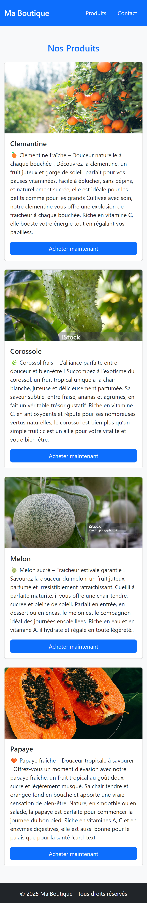

README.md
# Projet : Page d'atterrissage responsive pour une boutique

## Description
Ce projet est une démonstration d’une page d’atterrissage responsive réalisée avec **HTML**, **CSS** et **Bootstrap 5**.  
Il présente une sélection de produits frais avec un design adaptatif pour les écrans d’ordinateur et de téléphone mobile.

## Captures d'écran

### 💻 Version Desktop

*Affichage sur un ecran de 1040px*

### 📱 Version Mobile

*Affichage sur un iphone XR*

